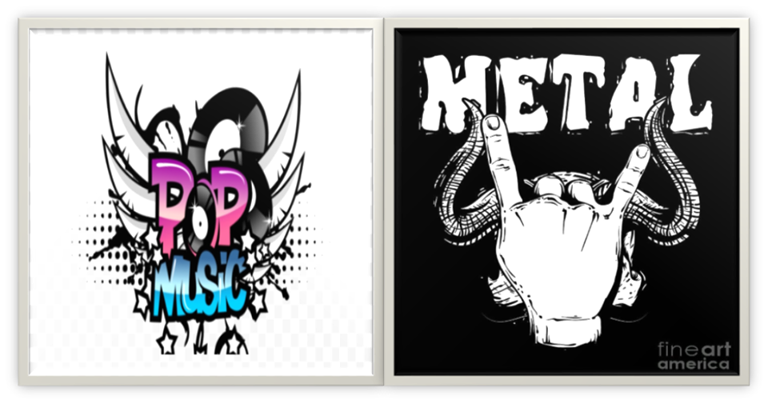
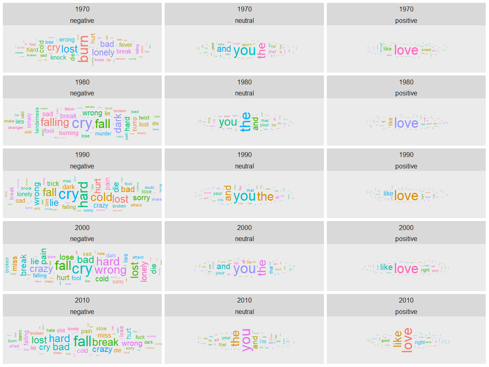
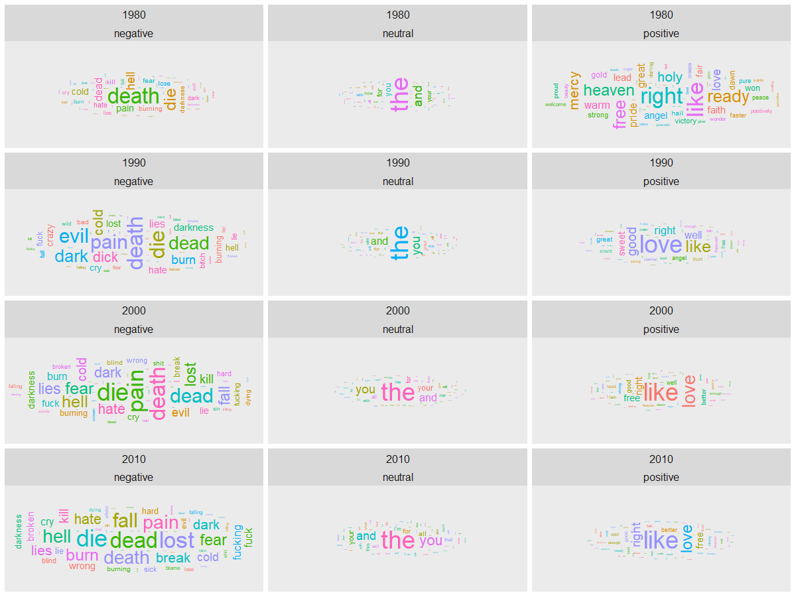
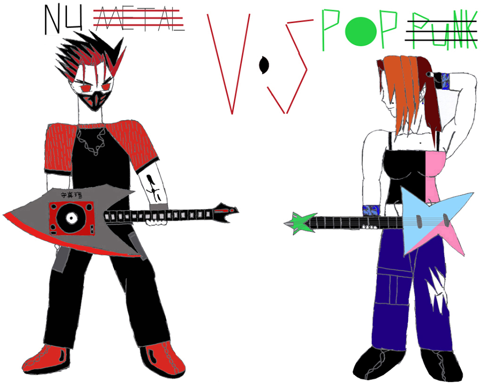

#### This report is a guidebook with selected Q&A aims at finding out the insights and differences between Pop and Metal.

#### The whole dataset: "lyrics.Rdata" is a filtered corpus of 380,000+ song lyrics from from MetroLyrics. You can read more about it on [Kaggle](https://www.kaggle.com/gyani95/380000-lyrics-from-metrolyrics). "info_artist.csv" provides the background information of all the artistis. These information are scraped from [LyricsFreak](https://www.lyricsfreak.com/).


```{r, warning=FALSE, message=FALSE,echo=FALSE}
knitr::opts_chunk$set(echo = TRUE)
```


```{r, message=FALSE, warning=FALSE,echo=FALSE}
packages.used=c("tm", "tidytext","tidyverse","DT","wordcloud","scales","gridExtra","ngram","igraph","ggraph","rsconnect", "syuzhet", "ggwordcloud")

# check packages that need to be installed.
packages.needed=setdiff(packages.used, 
                        intersect(installed.packages()[,1], 
                                  packages.used))
# install additional packages
if(length(packages.needed)>0){
  install.packages(packages.needed, dependencies = TRUE)
}

# load packages
library(dplyr)
library(stringr)
library(tm)
library(tidytext)
library(tidyverse)
library(DT)
library(wordcloud)
library(scales)
library(gridExtra)
library(ngram)
library(igraph)
library(ggraph)
library(rsconnect)
library(data.table)
library(scales)
library(shiny) 
library(syuzhet)
library(ggwordcloud) 
```


First,I processed the raw textual data 'dt_lyrics' saved in $ data $ file by cleaning data, removing stopwords and creating a tidy version of texts which is saved in $ output $ file as 'processed_data'. Then I load the processed data directly from output folder. 

This report is prepared using the processed_lyrics that is saved in the output file. 


```{r load data, warning=FALSE, message=FALSE}
# Load the processed text data along with artists information on contributors

# load lyrics data
dt_lyrics <- load('../output/processed_lyrics.RData') 
# load artist information
dt_artist <- fread('../data/artists.csv') 
```


## Question 1:  What are the music trends of Pop and Metal in general? Is pop really more positive than metal? 

In music industry, there have been always a comparision between pop and metal over their mainstream opposite, from the artists to their performance styles, from the lyrics to the rthyme. They also have very different types of fan who dislike the other genre a lot. 


I have always been curious about the differences between pop and metal music. As we all know, pop music is usually known as more emotional, romantic, and soft while metal music tends to be more intense, virtuosic, and powerful. I feel like this would be a great comparision between two totally different definitions and styles of genres to see if there are any insights we could learn more. 

I start with general ideas of how both of the genres have done historically through total number of songs and artists. 


```{r,echo=FALSE}

## Number of pop songs and artists per decade

##Adding Decade information

dt_lyrics$decade <- paste(str_sub(dt_lyrics$year, 1, 3), '0', sep = '')

temp  <- group_by(dt_lyrics, decade) %>% 
            filter(genre %in% c("Pop")) %>% 
            summarise(songs = n(),
                      artists = length(unique(artist))) %>% 
            arrange(desc(decade))

ggplot(data = temp, aes(x = decade, y = songs)) +
    geom_bar(stat = 'identity', aes(fill = decade)) +
    geom_label(aes(label = paste('songs:', songs, '\nartists: ', artists, sep = ''),
                   y = 1000, fill = decade), size = 4, hjust = 'left', alpha = 0.25) +
    coord_flip() +
    xlab('Decade') +
    ylab('') +
    labs(title = '                                  Total Pop Songs and Artists by Decade') +
    theme(legend.position = 0,
         text = element_text(size = 10),
         axis.text.x = element_blank())
```


```{r,echo=FALSE}

## Number of pop songs and artists per decade

temp1  <- group_by(dt_lyrics, decade) %>% 
            filter(genre %in% c("Metal")) %>% 
            summarise(songs = n(),
                      artists = length(unique(artist))) %>% 
            arrange(desc(decade))

ggplot(data = temp1, aes(x = decade, y = songs)) +
    geom_bar(stat = 'identity', aes(fill = decade)) +
    geom_label(aes(label = paste('songs:', songs, '\nartists: ', artists, sep = ''),
                   y = 1000, fill = decade), size = 4, hjust = 'left', alpha = 0.25) +
    coord_flip() +
    xlab('Decade') +
    ylab('') +
    labs(title = '                                  Total Metal Songs and Artists by Decade') +
    theme(legend.position = 0,
         text = element_text(size = 10),
         axis.text.x = element_blank())
```

According to the above charts, pop music began earlier than metal music because pop started since 1970s. Furthermore, pop music did not only start earlier, but also was more active at the early stage. Both of the genres increased rapidly the number of songs and artists within 2000s.Even thoguh they both seemed decreasing a lot in 2010s, it can not be concluded that they have been less active due to the lastest year of the dataset is 2016. 

To have a better general understanding of the nature in both genres, I try to figure out the top most used words of each genre. The two separates word clouds are showing the most used words in pop and metal respectively. 


```{r, warning=FALSE, message=FALSE,echo=FALSE}
pop_song <- dt_lyrics[dt_lyrics$genre == "Pop",]

bag_of_words_pop_song <-  pop_song %>%
  unnest_tokens(word, stemmedwords)

word_count_pop_song <- bag_of_words_pop_song %>%
  count(word, sort = TRUE)
```


```{r,message=FALSE,warning=FALSE,echo=FALSE}
wordcloud(word_count_pop_song$word,word_count_pop_song$n,
          scale=c(5,0.2),
          max.words=100,
          min.freq=2,
          random.order=FALSE,
          rot.per=0.5,
          use.r.layout=T,
          random.color=FALSE,
          colors=brewer.pal(9,"Blues"))
```

```{r, warning=FALSE, message=FALSE,echo=FALSE}
metal_song <- dt_lyrics[dt_lyrics$genre == "Metal",]

bag_of_words_metal_song <-  metal_song %>%
  unnest_tokens(word, stemmedwords)

word_count_metal_song <- bag_of_words_metal_song %>%
  count(word, sort = TRUE)

```


```{r,message=FALSE,warning=FALSE,echo=FALSE}
wordcloud(word_count_metal_song$word,word_count_metal_song$n,
          scale=c(5,0.2),
          max.words=100,
          min.freq=2,
          random.order=FALSE,
          rot.per=0.5,
          use.r.layout=T,
          random.color=FALSE,
          colors=brewer.pal(9,"Greens"))
```


As we can see above, Pop genre mostly used softer emotion words (love, baby, time, heart, ill, etc.), especially the word "love" has been used a lot more than the other most used words in the genre which results in larger size and darker color of the word "love" than otherw words in the cloud. In constract, even though metal genre has positive words (live, love, dream), it has more used darker words comparing to pop (fear, lost, dead, burn, dies, dark, etc.). Also, the used word frequency of metal genre are close to each other as the metal word cloud shows a lot of words used and the size and color of these words are not much different. 

## Question 2: Who are the hardest working artists in these genres? Did they follow the trends? Or did they write their music with their own style? 

In order to have a deeper understanding of the genres, I consider the hardest working artists of pop and metal by counting the total number of songs per artist in each genre and showing the result of top ten most prolific artists of all time in both. 

```{r,message=FALSE,warning=FALSE,echo=FALSE}
temp2 <- count(dt_lyrics, genre, artist, sort = TRUE) %>% 
  group_by(genre) %>% 
  arrange(desc(n)) %>% 
  filter(row_number() <= 10) %>% 
  arrange(desc(genre), desc(n)) %>%
  filter(genre %in% c("Pop"))

ggplot(temp2, aes(artist, n))+
      geom_col() +
      labs(title = "                       The Most Prolific Pop Artists of All Time")+
      xlab(NULL) +
      ylab("Number of songs")+
      coord_flip()
``` 


For pop genre, Bee Gees has the highest total number of songs (almost 600 songs) and Barbra Streisand is only a little bit below the first. The number 10th on the list goes to Gary Numan with about 230 songs.

```{r,message=FALSE,warning=FALSE,echo=FALSE}
temp3 <- count(dt_lyrics, genre, artist, sort = TRUE) %>% 
  group_by(genre) %>% 
  arrange(desc(n)) %>% 
  filter(row_number() <= 10) %>% 
  arrange(desc(genre), desc(n)) %>%
  filter(genre %in% c("Metal"))

ggplot(temp3, aes(artist, n))+
      geom_col() +
      labs(title = "                       The Most Prolific Metal Artists of All Time")+
      xlab(NULL) +
      ylab("Number of songs")+
      coord_flip()
``` 

For metal genre, Fall has the highest total number of songs (about 300 songs) and have a far distance compare to the other artists in the chart above. The number 10th does to Acid Drinkers with about 110 songs. 


Overall, with the given dataset, the most prolific artists in pop genre is more active than metal genre's. The number one in the most prolific chart for pop genre has produced about two times more than the number one in metal. Furthermore, the number 10th in pop genre also has produced about two times more than the number 10th in metal. 


Now it is interesting to see if these most prolific artists had followed the trends of their genre. I used the word clouds to show the most used words by these artists and see if there are any differences compare to their genre in general. 


```{r, warning=FALSE, message=FALSE,echo=FALSE}
pop_singers <- count(dt_lyrics, genre, artist, stemmedwords, sort = TRUE) %>% 
                group_by(genre) %>% 
                arrange(desc(n)) %>% 
                filter(row_number() <= 10) %>% 
                arrange(desc(genre), desc(n)) %>%
                filter(genre %in% c("Pop"))

bag_of_words_pop_song_artirst <-  pop_singers %>%
  unnest_tokens(word, stemmedwords)

word_count_pop_song_artist <- bag_of_words_pop_song_artirst %>%
  count(word, sort = TRUE)
```

```{r,message=FALSE,warning=FALSE,echo=FALSE}
wordcloud(word_count_pop_song_artist$word,word_count_pop_song_artist$n,
          scale=c(5,0.2),
          max.words=100,
          min.freq=2,
          random.order=FALSE,
          rot.per=0.5,
          use.r.layout=T,
          random.color=FALSE,
          colors=brewer.pal(9,"Blues"))
```

For pop genre, the artists used the word "blame" the most while in genreal, the word "love" was used most in the genre. Even though "love" was still used a lot in the genre, these artists have used vocabularies wisely with more emotions, such as miss, pain, cry, lie, broke, etc. Therefore, the most prolific pop artists did not seem following the general music genre, but more into their own styles and express different emotions in their songs. 


```{r, warning=FALSE, message=FALSE,echo=FALSE}
metal_singers <- count(dt_lyrics, genre, artist, stemmedwords, sort = TRUE) %>% 
                group_by(genre) %>% 
                arrange(desc(n)) %>% 
                filter(row_number() <= 10) %>% 
                arrange(desc(genre), desc(n)) %>%
                filter(genre %in% c("Metal"))

bag_of_words_metal_song_artist <-  metal_singers %>%
  unnest_tokens(word, stemmedwords)

word_count_metal_song_artist <- bag_of_words_metal_song_artist %>%
  count(word, sort = TRUE)
```

```{r,message=FALSE,warning=FALSE,echo=FALSE}
wordcloud(word_count_metal_song_artist$word,word_count_metal_song_artist$n,
          scale=c(5,0.2),
          max.words=100,
          min.freq=2,
          random.order=FALSE,
          rot.per=0.5,
          use.r.layout=T,
          random.color=FALSE,
          colors=brewer.pal(9,"Greens"))
```

For metal genre, the artists used the top three words (life, time, youre) as the same like its the genre. However, it looks like the artists also used more on some words that were not used a lot in genre (beat, slip, insides, path, leave, inside) and new words (avantasia). Therefore, the metal artists's song lyrics seem more following to the trends of the genre than pop, but these artists are also have their creativity and different emotion impression in their lyrics.

## Question 3: How did the sentiments in Pop and Metal change over the decades and how do they compare to each other?

From the figures above, we know how both genres are in general. Besides the msot used words in general, it would be more informative to see how these genres have changed over decade using sentiments analysis. 

In this question, I would like to see how the sentiments using the bing sentiment lexion: "The bing emotion is a list of English words and their associations with three basic emotions (negative, positive, neutral)."

Let's start with Pop genre

```{r,message=FALSE,warning=FALSE,include=FALSE}

lyrics_token_pop <- unnest_tokens(dt_lyrics,
                              input = lyrics,
                              output = word,
                              token = 'words',
                              drop = TRUE,
                              to_lower = TRUE)
lyrics_token_pop <- filter(lyrics_token_pop,
                       str_detect(word, '^[a-z]') &
                       (genre %in% c("Pop")) &
                       nchar(word) >= 3)

bing = get_sentiments('bing')
lyrics_token_pop$sentiment = plyr::mapvalues(lyrics_token_pop$word, 
                                         bing$word, bing$sentiment, 
                                         warn_missing = FALSE)

lyrics_token_pop$sentiment = if_else(!(lyrics_token_pop$sentiment %in% c('positive', 'negative')), 
                                    'neutral', lyrics_token_pop$sentiment)

sample_n(lyrics_token_pop, size = 15)

count_words <- count(lyrics_token_pop, word, sentiment, sort = TRUE)

```

```{r,message=FALSE,warning=FALSE,echo=FALSE}
gw <- group_by(lyrics_token_pop, decade, sentiment, word) %>%
  summarise(gw_c = n()) %>% 
  ungroup() %>% 
  group_by(decade) %>%
  mutate(gw_p = gw_c / sum(gw_c)) %>% 
  ungroup() %>%
  arrange(decade, desc(gw_p)) %>% 
  group_by(word) %>% 
  mutate(w_c = sum(gw_c))

w <- group_by(lyrics_token_pop, sentiment, word) %>%
  summarise(w_c = n()) %>% 
  ungroup() %>%
  mutate(w_p = w_c / sum(w_c)) %>%
  arrange(desc(w_c))
```

```{r,message=FALSE,warning=FALSE, include=FALSE}
## World cloud sentiment in pop

temp4 <- group_by(gw, decade, sentiment) %>%  
    arrange(desc(gw_p)) %>% 
    filter(row_number() < 60) %>%
    mutate(angle = 90 * sample(c(0, 1), n(), replace = TRUE, prob = c(70, 30)), 
           freq_sd = (gw_c - min(gw_c)) / (max(gw_c) - min(gw_c))) %>% 
    ungroup()

options(repr.plot.width = 10, repr.plot.height = 40)

plt1 <- ggplot(data = temp4,
  aes(label = word, 
      size = freq_sd,
      color = factor(sample.int(10, nrow(temp4), replace = TRUE)), 
      angle = angle)) +
  geom_text_wordcloud_area() +
  scale_size_area(max_size = 10) +
  facet_wrap(decade ~ sentiment, nrow = 5) +
  theme(text = element_text(size = 15))

#Run the follwing line in console for better plot sizing  because the figure is constrained in size in R note book. 

suppressWarnings(print(plt1)) 

# The image below is saved in fig folder after running the code through console. 
```




According to the figure above, pop music has not changed much in neutral and positive sentimentssince 1970s. In these two sentiments, the word clouds of each decade show similar most used words. However, in the negative sentiment, the most used words in lyrics were different from each decade. For example, the top three most useds word in negative sentiment in 1970s are "burn", "lost", "lonely" while the top three most used words in 1980s are "cry", "falling", "fall". Also, in 2010s, some cursing words are used more in pop genre. 

Now, let's take a look at Metal genre. 


```{r,message=FALSE,warning=FALSE,include=FALSE}
#The bing emotion is a list of English words and their associations with three basic emotions (negative, positive, neutral)

lyrics_token_metal <- unnest_tokens(dt_lyrics,
                              input = lyrics,
                              output = word,
                              token = 'words',
                              drop = TRUE,
                              to_lower = TRUE)

lyrics_token_metal <- filter(lyrics_token_metal,
                       str_detect(word, '^[a-z]') &
                       (genre %in% c("Metal")) &
                       nchar(word) >= 3)

bing = get_sentiments('bing')
lyrics_token_metal$sentiment = plyr::mapvalues(lyrics_token_metal$word, 
                                         bing$word, bing$sentiment, 
                                         warn_missing = FALSE)

lyrics_token_metal$sentiment = if_else(!(lyrics_token_metal$sentiment %in% c('positive', 'negative')), 
                                    'neutral', lyrics_token_metal$sentiment)

sample_n(lyrics_token_metal, size = 15)

count_words <- count(lyrics_token_metal, word, sentiment, sort = TRUE)

```

```{r,message=FALSE,warning=FALSE,echo=FALSE}
gw1 <- group_by(lyrics_token_metal, decade, sentiment, word) %>%
  summarise(gw_c = n()) %>% 
  ungroup() %>% 
  group_by(decade) %>%
  mutate(gw_p = gw_c / sum(gw_c)) %>% 
  ungroup() %>%
  arrange(decade, desc(gw_p)) %>% 
  group_by(word) %>% 
  mutate(w_c = sum(gw_c))

w1 <- group_by(lyrics_token_metal, sentiment, word) %>%
  summarise(w_c = n()) %>% 
  ungroup() %>%
  mutate(w_p = w_c / sum(w_c)) %>%
  arrange(desc(w_c))
```


```{r,message=FALSE,warning=FALSE, include=FALSE}
## Word cloud sentiment in Metal

temp5 <- group_by(gw1, decade, sentiment) %>%  
    arrange(desc(gw_p)) %>% 
    filter(row_number() < 60) %>%
    mutate(angle = 90 * sample(c(0, 1), n(), replace = TRUE, prob = c(70, 30)), 
           freq_sd = (gw_c - min(gw_c)) / (max(gw_c) - min(gw_c))) %>% 
    ungroup()

options(repr.plot.width = 10, repr.plot.height = 40)

plt1 <- ggplot(data = temp5,
  aes(label = word, 
      size = freq_sd,
      color = factor(sample.int(10, nrow(temp5), replace = TRUE)), 
      angle = angle)) +
  geom_text_wordcloud_area() +
  scale_size_area(max_size = 10) +
  facet_wrap(decade ~ sentiment, nrow = 5) +
  theme(text = element_text(size = 15))

#Run the follwing line in console for better plot sizing  because the figure is constrained in size in R note book. 

suppressWarnings(print(plt1)) 

# The image below is saved in fig folder after running the code through console. 
```




In metal genre, the positive sentiment is changed a lot and becomes more simplified after 1980s. As we can see, there are more vocabularies used in 1980s, and love was not used mostly there. This result can be because of the early stage of the genre, where there were not a lot of metal songs and artists. Since 1990, the positive sentitments of each decade are pretty much similar in metal.

The negative sentiment of metal genre shows that there are more and more vocabularies used and the words used are pretty much similar over time. Besides using intense words, this genre also has a large uses of cursing words. 

So how pop music and metal music compare to each othe over time: 

In comparision, pop music has very simple words used in positive and neutral sentiments, but more diversity and emtionality in negative sentiment while metal music has also simple but more number of words used in positive and neutral sentiment, but similarity of meanings in negative sentiment. Furthermore, metal music used more heavy, intense, and darker words in their lyrics. 





## Conclusions

1. In general, pop genre is more active comparing to metal genre with larger amount of songs and artists per decace. Furthermore, pop lyrics use more soft emotion words in their lyrics and do not have a lot of heavy intense words in their songs. Metal lyrics also have some positive words in their songs, but not as much compare to darker words. 

2. The most prolific artists groups of both genres do have their own styles in their songs. They do not follow the genres' trends  as much. 

3. Historically, pop and metal music has similar frequency of used words in all three sentiments (positive, neutral, and negative). They both also used more word in negative sentiments. However, the metal music has more intense, darker, heavy words in their lyrics.  


